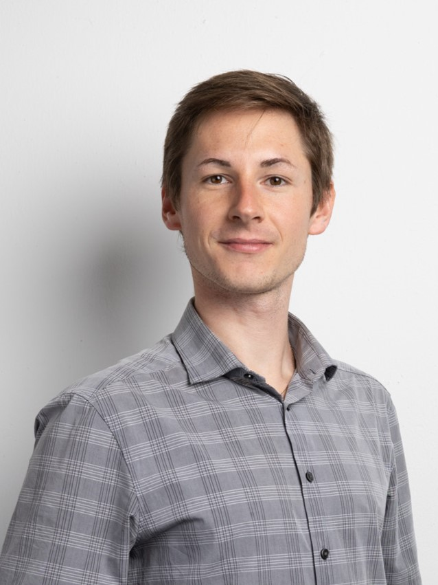

> **Digital Innovation at heart to transform data into scalable, actionable solutions.**
> 
> I am a Data Scientist and Civil Industrial Engineer specializing in machine learning, artificial intelligence, and strategic data analysis/business analytics. I identify pain points and build systems that bridge the gap between advanced analytical models and practical business operations.

---

## 🔧 Core Competencies

* **Domains:** Machine Learning & Deep learning, AI Strategy & Governance, Data Governance, Data Processing, Data Visualization & Data Infrastructure.
* **Main Coding Languages:** Python, R, SQL, C.
* **Languages:** Spanish, English & German.

---

## 💼 Latest Experience

* **Freelance Specialist in Data Science, - Infrastructure, - Processing, - Analysis, and Artificial Intelligence** | *Upwork Consulting* (May 2025 – Present)
  Focusing on data processing, application testing, and building tailored business solutions.
  
* **Artificial Intelligence Advisor** | *Chamber of Deputies, National Congress of Chile* (March 2025 - May 2025)
  Advised on technological implications and frameworks for a legislative regulation project.
  
* **International Internship as Digital Innovation Consultant (Data Analysis and AI)** | *Henn Connector Group (Dornbirn, Austria)* (Jul 2024 – Dec 2024)
  Contributed to the development and implementation of AI-driven strategies and operational models.
  
* **Co-Founder & Entrepreneur/Manager** | *Oferte_ch & Kibō Patagonia SPA* (April 2014 – Present)
  Created and managed a digital marketplace platform for buying and selling technology. Contributed in the creation of brand identity while scaling-up production.

## 📑 Research & Projects

* **USE OF LARGE LANGUAGE MODELS TO IDENTIFY EMPATHY (M.Sc. Thesis):** Researched and developed an artificial intelligence model pipeline to analyze and detect empathy markers, successfully defended in August 2025 and graduated in December 2025.

---

<footer class="custom-footer">

&copy; 2026 Thomas Winkler

<strong style="color: #606c71;">🔗 Let's Connect:</strong>
<a href="mailto:thwineu@gmail.com" class="footer-link" style="display: flex; align-items: center; gap: 5px;">
 Email
</a> | 
<a href="https://www.linkedin.com/in/thwineu/" class="footer-link" style="display: flex; align-items: center; gap: 5px;">
 LinkedIn
</a> | 
<a href="https://x.com/thwineu" class="footer-link" style="display: flex; align-items: center; gap: 5px;">
 Twitter/X
</a> | 
<a href="https://github.com/th-winkler" class="footer-link" style="display: flex; align-items: center; gap: 5px;">
 GitHub
</a>

Additional information

Follow this site's development in my <a href="https://github.com/thwineu/thwineu.github.io">GitHub Repository</a>. 
<a href="https://github.com/pages-themes/cayman">Cayman</a> is maintained by <a href="https://github.com/pages-themes">pages-themes</a>. | This page was generated by <a href="https://pages.github.com/">GitHub Pages</a>. 
Icons created by <a href="https://www.flaticon.com/authors/freepik" title="Freepik icons">Freepik</a> - Obtained from <a href="https://www.flaticon.com/">Flaticon.com</a>

</footer>
